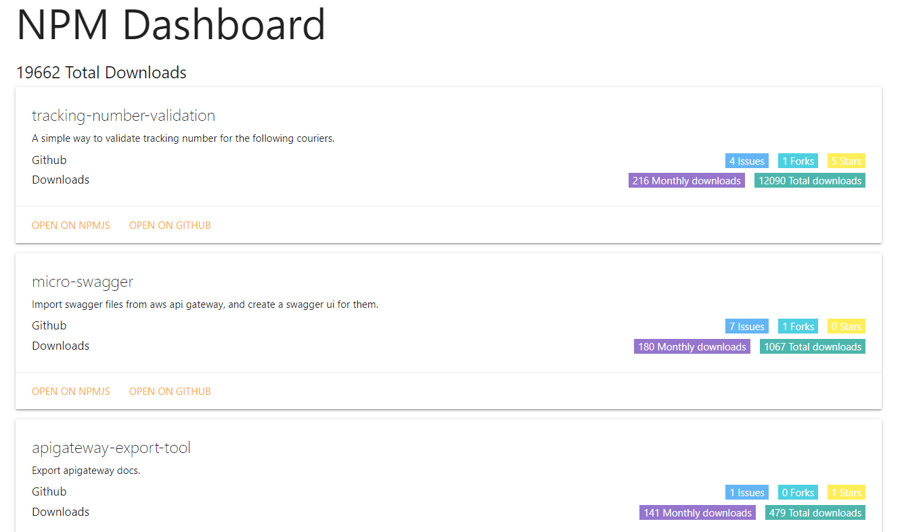

# npmdash

fetch and display npm packages info, like downloads, stars, issues etc...

[Try it out](http://npm.devresources.site/)

### cli usage

```
npm i -g npmdash
npmdash -u <npm username>
```

### docker usage

```
docker pull niradler/npmdash
docker container run -p 8989:8989 npmdash
```

### tech stack
- nodejs
- typescript
- puppeteer (for packages list)
- commander (cli)
- docker
- aws fargate

### screenshots



