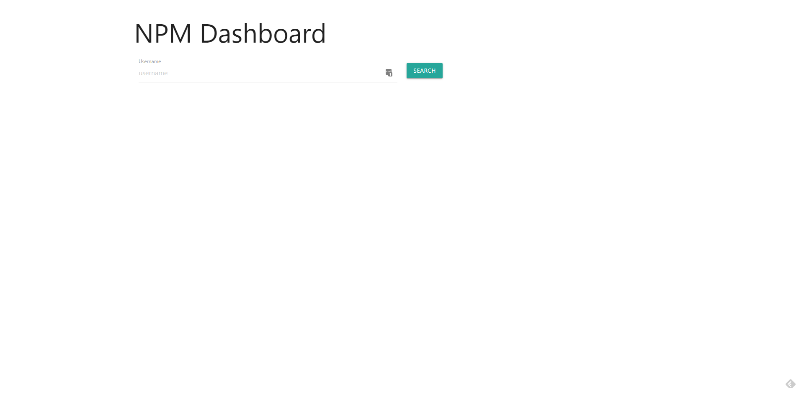
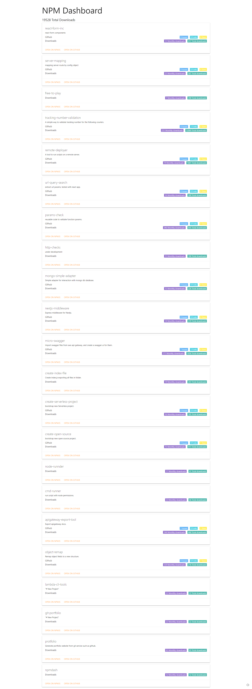

# npmdash

fetch npm packages info, like downloads, stars, issues etc...

[Try it out](http://npm.devresources.site/)

### cli

```
npx npmdash -u <npm username>
# or
npm i -g npmdash
npmdash -u <npm username>
```
### screenshots



